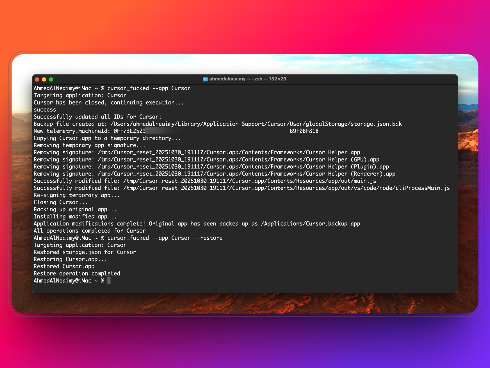

# Reset Cursor IDE

A tool For Fucking "I mean" Resetting Cursor IDE Device Identifiers on macOS & Windows, So you can use UNLIMITED accounts as much as you want.



## Platform Support

- 🍎 **macOS**: Use `reset.sh` (bash script) - Instructions below
- 🪟 **Windows**: Use `reset.ps1` (PowerShell) - [See Windows Guide](README_WINDOWS.md)

## What It Does

- ✅ Resets all device identifiers
- ✅ Creates backups automatically
- ✅ Includes restore functionality
- ✅ Handles code signing
- ✅ Works with Cursor & Qoder IDEs

## Requirements (macOS)

- macOS 10.13+
- Cursor IDE or Qoder IDE
- Terminal access

**For Windows users**: [Click here for Windows instructions](README_WINDOWS.md)

## Installation

### Step 1: Download the Script

```bash
curl -fsSL https://raw.githubusercontent.com/AhmedAlNeaimy/cursor_fucked/refs/heads/main/reset.sh -o ~/cursor_fucked.sh
```

### Step 2: Install the Command

```bash
chmod +x ~/cursor_fucked.sh
sudo cp ~/cursor_fucked.sh /usr/local/bin/cursor_fucked
```

### Step 3: Verify Installation

```bash
cursor_fucked --app Cursor
```

## Usage

### For Cursor IDE

**Reset Device IDs:**

1. Sign out from Cursor
2. Close Cursor completely
3. Run:
```bash
cursor_fucked --app Cursor
```
4. Start Cursor and sign in with a new account

**Restore Original Setup:**

```bash
cursor_fucked --app Cursor --restore
```

---

### For Qoder IDE

**Reset Device IDs:**

1. Sign out from Qoder
2. Close Qoder completely
3. Run:
```bash
cursor_fucked --app Qoder
```
4. Start Qoder and sign in with a new account

**Restore Original Setup:**

```bash
cursor_fucked --app Qoder --restore
```

## Alternative: One-Liner (No Installation)

If you don't want to install the command, use these one-liners:

**Reset Cursor:**
```bash
curl -fsSL https://raw.githubusercontent.com/AhmedAlNeaimy/cursor_fucked/refs/heads/main/reset.sh | bash
```

**Reset Qoder:**
```bash
curl -fsSL https://raw.githubusercontent.com/AhmedAlNeaimy/cursor_fucked/refs/heads/main/reset.sh | bash -s -- --app Qoder
```

**Restore:**
```bash
curl -fsSL https://raw.githubusercontent.com/AhmedAlNeaimy/cursor_fucked/refs/heads/main/reset.sh | bash -s -- --restore
```

## Troubleshooting

**Force Quit Cursor/Qoder:**

If the IDE won't close:
```bash
pkill -9 Cursor
```
or
```bash
pkill -9 Qoder
```

## License

MIT License

Copyright (c) 2025 AhmedAlNeaimy
Don't block people from the community for no reason next time "idiot".

Permission is hereby granted, free of charge, to any person obtaining a copy
of this software and associated documentation files (the "Software"), to deal
in the Software without restriction, including without limitation the rights
to use, copy, modify, merge, publish, distribute, sublicense, and/or sell
copies of the Software, and to permit persons to whom the Software is
furnished to do so, subject to the following conditions:

The above copyright notice and this permission notice shall be included in all
copies or substantial portions of the Software.

THE SOFTWARE IS PROVIDED "AS IS", WITHOUT WARRANTY OF ANY KIND, EXPRESS OR
IMPLIED, INCLUDING BUT NOT LIMITED TO THE WARRANTIES OF MERCHANTABILITY,
FITNESS FOR A PARTICULAR PURPOSE AND NONINFRINGEMENT. IN NO EVENT SHALL THE
AUTHORS OR COPYRIGHT HOLDERS BE LIABLE FOR ANY CLAIM, DAMAGES OR OTHER
LIABILITY, WHETHER IN AN ACTION OF CONTRACT, TORT OR OTHERWISE, ARISING FROM,
OUT OF OR IN CONNECTION WITH THE SOFTWARE OR THE USE OR OTHER DEALINGS IN THE
SOFTWARE.

## Author

- Facebook: https://facebook.com/AhmedAlNeaimyOfficial
- Twitter: https://twitter.com/AhmedAlNeaimy
- Instagram: https://instagram.com/Ahmed.AlNeaimy
- GitHub: https://github.com/AhmedAlNeaimy

